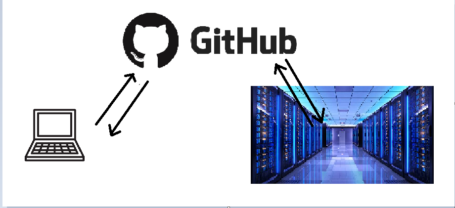

# Unforgettable_Git
CURSO GIT Paso a paso.

Definición 1. Un control de versiones es una herramienta para gestionar cambios o colaborar con más personas en un fichero. Entre los principales usos.

1. Conceptos previos.

Definición 1.1. Un repositorio es una colección de ficheros y directorios que queremos versionar.
Definición 1.2. Un cambio es una modificación de ficheros.

2. Tipos de controles de versiones.

2. 1. Control de versiones centralizados. 

Para leer el Libro de Ajedrez, Dados y Tablas de Alfonso X el Sabio de la Real Biblioteca del Monasterio de San Lorenzo de El Escorial, 
hay que leerlo en persona. Si quiero estudiarlo en mi casa, tendré que conseguir una versión escaneada de los capítulos que me interesan, 
no me puedo llevar ni copiar el manuscrito entero. Si alguna persona tiene que restaurarlo, o Alfonso X resucita y quiere añadir nuevas jugadas, entonces, tiene que pedir un permiso y tiene que ir a la biblioteca.

2. 1. Control de versiones distribuidos.

Josechu sube los apuntes al Moodle. Todos tenemos acceso a los apuntes de Josechu de Geometría. Trabajas sobre ellos, los emborronas, añades gráficas. No necesito estar en las clase de Josechu para ver sus apuntes en la pizarra, porque los tengo descargados (offline). Josechu tampoco puede ver las atrozidades matemáticas que escribo porque todavía no le he mandado las erratas (push/pull de archivos). Las erratas que vemos tienen que 
ser enviadas a Josechu para que haga las modificaciones, y los estudiantes no se encuentren con un signo menos donde no había. Josechu es el repositorio central.

Aquí es dónde enocontramos Git :). Un sistema de control de versiones distribuido.

3. Git 
3. 1.Conceptos previos.

Definición 3.1. Un registro histórico es la trazabilidad del fichero. ¿Quién lo modifició?¿Cuándo?¿Por qué?
Definición 3.2. Un commit es la unidad mínima de almacenamiento.

3. 2.¿Para qué usamos Git?

Tenemos Git para mi. Voy controlando los cambios que hago.

O podemos usar Git con más gente. Sincronizar a todas las personas que colaboran en un proyecto a través de un repositorio central. En este caso el repositorio central/remoto se llama GitHub. 

3. 3.¿Cómo vamos trabajando con las modificaciones de los ficheros?

Tenemos tres identidades en las que vamos pasando los archivos: 

Mi ordenador-GitHub (el repositorio central/remoto)-Servidor

3. 4.¿Cómo interectuamos con el repositorio central aka GitHub?

Opción 1. Con la terminal de Git.

Opción 2. Con un cliente gráfico: RStudio, VSCode (editor de código).

4. Creemos un nuevo repositorio en nuestra cuenta de GitHub dede VSCode.

Paso 1. Log In en GitHub :)
Paso 2. Creemos un nuevo repositorio en nuestra cuenta.

Paso 3. Como queremos trabajar en local (es decir, queremos hacer todas las modificaciones desde nuestro pórtatil o nuestro servidor local), necesitamos clonar nuestro repositorio. ¡Crear las flechas de nuestro esquema! 
Es hora de crear nuestro clon en VSCode. Aunque podemos usar los diferentes iconos, aquí usaremos la terminal, y clonaremos usando nuestro URL en SSH (para mayor seguridad).

¿Dónde encontrar el URL?

¿Cómo clonar en VSCode?

Como estamos iniciando nuestro repositorio desde cero, tenemos que añadir algún archivo para empezar. ¡No queremos trabajar con un conjunto vacío! Desde GitHub nos recomiendan crear un archivo README.md y realizar nuestro primer commit, es decir, ¡nuestro primer cambio registrado! Toda esta información aparecerá en GitHub cuando veas el interior de tu nuevo repositorio (el listado de código que parece que va a generarte una bomba nuclear). Aquí: 

Veamos que nos quiere decir, cuando ejecutemos este código en nuestra terminal.

echo "# Unforgettable_Git" >> README.md 

En esta línea de código creamos este archivo para convertir nuestro ahora conjunto vacío, en un repositorio con aspiraciones.

git init

Inicializamos nuestro repositorio.

git add README.md

Añadimos en nuestro repositorio  el archivo que hemos creado.

git commit -m "first commit"

Queremos guardar nuestro primer cambio. Por eso queremos crear nuestro primer registro de cambios con un mensaje para que nos quede claro, este es nuestro "first commit" en el repositorio.

A partir de ahora queremos indicar donde se van a guardar todos los cambios que vamos haciendo. Y para ello creamos una "branch" donde encontraremos el registro de cambios.

git branch -M main

Esta es la rama principal que tendrá el registro de cambios almacenados/commits. Por supuesto , podemos crear todas las ramas que queramos en las que añadiremos los commits, pero esto no nos interesa en este momento :) .

Además, de ponerle un bonito nombre a nuestro registro, cada vez que queramos trabajar en este repositorio copiar nuestro URL inicial sería tedioso, y un poco feo :/, por eso también vamos a ponerle un nombre original. Como el repositorio es el origen de nuestra aventura, le llamaremos 'origin':

git remote add origin git@github.com:Aliiciaaa/Unforgettable_Git.git

Todo está ready, pero simplemente hemos hecho un registro del cambio. ¿Cómo lo podemos ver en GitHub? Por favor git, podrías añadir mis cambios a 'origin', no sólo a origin, pero porfa, no te salgas del registro que hemos marcado, de nuestra 'branch':

git push origin 
git push -u origin main 